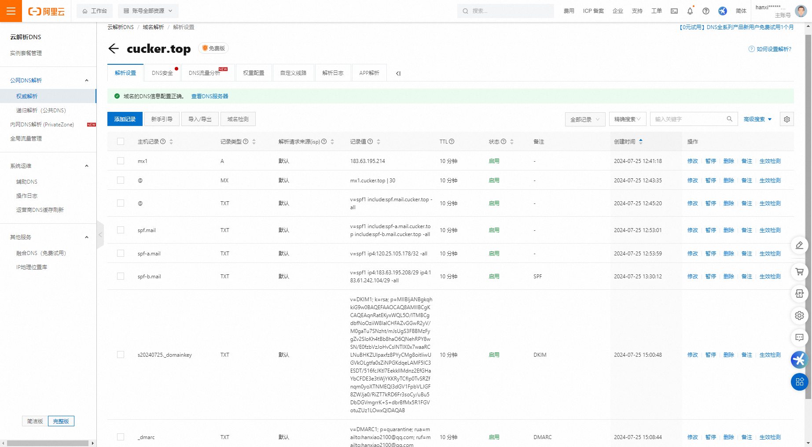
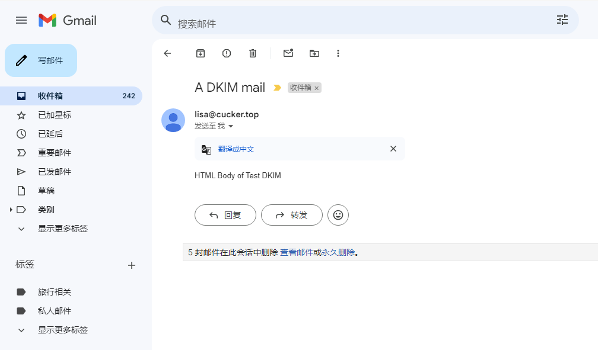

# 生成 DKMI 签名的邮件，并发送该邮件

## 准备工作
1. 安装依赖包
```bash
pip install dkimpy dnspython
```

2. 生成 SHA key-peer
```bash
cd <work_dir>

python ./gen_rsa_key_peer.py
```
在当前目录生成 私钥 private.pem，公钥 public.pem

3. 创建相关的 DNS 记录
    
如 域名：cucker.top

创建先关的记录   


验证 DNS 记录是否生效
```bash
// A 记录，指向邮件服务器
$ dig +noall +answer mx1.cucker.top A
mx1.cucker.top.		600	IN	A	183.63.195.214

// MX 记录
$ dig +noall +answer cucker.top MX
cucker.top.		600	IN	MX	30 mx1.cucker.top.

// SPF 记录
$ dig +noall +answer cucker.top TXT
cucker.top.		600	IN	TXT	"v=spf1 include:spf.mail.cucker.top -all"

$ dig +noall +answer spf.mail.cucker.top TXT
spf.mail.cucker.top.	600	IN	TXT	"v=spf1 include:spf-a.mail.cucker.top include:spf-b.mail.cucker.top -all"

dig +noall +answer spf-a.mail.cucker.top TXT
spf-a.mail.cucker.top.	600	IN	TXT	"v=spf1 ip4:120.25.105.178/32 -all"

$ dig +noall +answer spf-b.mail.cucker.top TXT
spf-b.mail.cucker.top.	600	IN	TXT	"v=spf1 ip4:183.63.195.208/29 ip4:183.61.242.104/29 -all"

// DKIM 记录
// 选择器为 s20240725，主机名：s20240725._domainkey
$ ddig +noall +answer s20240725._domainkey.cucker.top TXT
s20240725._domainkey.cucker.top. 600 IN	TXT	"v=DKIM1; k=rsa; p=MIIBIjANBgkqhkiG9w0BAQEFAAOCAQ8AMIIBCgKCAQEAqnRatEKyxWQL5O/lTMBCgdbfNoOziiW8IalCHFAZvGGwR2yV/M0gaTu7SNzht/mJsUgS3FBBMzFygZv2SloKh4tBb8haO6QNehRPY8wSN/E0fzbVzJoHvCsINTIX0x7waaRCLNuBHKZUlpaxfz8PYyCMg8oitIiwUGVkOLgtfa0sZiNPGKdqeLAMF5IC3ESDT" "/516fcJKtl7EekkllMdnz2EfGHaYbCFDE3e3tWjYKKRyTCfIp0TvSRZfnqm0yoXTNMEQI3dGV1FpbVLJGF8ZWJja0/RiZT7kRD6Fr3soCy/uBu5DbDGVmgrrK+S+dbrBfMx5R1FGVotuZUz1LOwxQIDAQAB"

// DMARC 记录
$ dig +noall +answer _dmarc.cucker.top TXT
_dmarc.cucker.top.	600	IN	TXT	"v=DMARC1; p=quarantine; rua=mailto:hanxiao2100@qq.com; ruf=mailto:hanxiao2100@qq.com"
```

## 发送邮件
```bash
mkdir -p /data/mail
cd /data/mail

// 生成 RSA key-peer
python ./gen_rsa_key_peer.py

// 发送邮件
python ./send_a_email_with_dkim_signature.py
```

* 示例
```bash
$ tree /data/mail/add_dkim_signature
/data/mail/add_dkim_signature
├── gen_rsa_key_peer.py
├── private.pem
├── public.pem
├── README.md
└── send_a_email_with_dkim_signature.py


[root@rocky9 add_dkim_signature]# python send_a_email_with_dkim_signature.py 
send: 'ehlo [10.100.240.130]\r\n'
reply: b'250-mx.google.com at your service, [183.63.195.214]\r\n'
reply: b'250-SIZE 157286400\r\n'
reply: b'250-8BITMIME\r\n'
reply: b'250-ENHANCEDSTATUSCODES\r\n'
reply: b'250-PIPELINING\r\n'
reply: b'250-CHUNKING\r\n'
reply: b'250 SMTPUTF8\r\n'
reply: retcode (250); Msg: b'mx.google.com at your service, [183.63.195.214]\nSIZE 157286400\n8BITMIME\nENHANCEDSTATUSCODES\nPIPELINING\nCHUNKING\nSMTPUTF8'
send: 'mail FROM:<lisa@cucker.top> size=1294\r\n'
reply: b'250 2.1.0 OK 5614622812f47-3db1348b073si610647b6e.72 - gsmtp\r\n'
reply: retcode (250); Msg: b'2.1.0 OK 5614622812f47-3db1348b073si610647b6e.72 - gsmtp'
send: 'rcpt TO:<hanxiao2100@gmail.com>\r\n'
reply: b'250 2.1.5 OK 5614622812f47-3db1348b073si610647b6e.72 - gsmtp\r\n'
reply: retcode (250); Msg: b'2.1.5 OK 5614622812f47-3db1348b073si610647b6e.72 - gsmtp'
send: 'data\r\n'
reply: b'354  Go ahead 5614622812f47-3db1348b073si610647b6e.72 - gsmtp\r\n'
reply: retcode (354); Msg: b'Go ahead 5614622812f47-3db1348b073si610647b6e.72 - gsmtp'
data: (354, b'Go ahead 5614622812f47-3db1348b073si610647b6e.72 - gsmtp')
send: b'Content-Type: multipart/alternative; boundary="===============0552393707957777554=="\r\nMIME-Version: 1.0\r\nFrom: lisa@cucker.top\r\nTo: hanxiao2100@gmail.com\r\nSubject: A DKIM mail\r\nMessage-ID: <1721903050.9762783-lisa@cucker.top>\r\nDKIM-Signature: v=1; a=rsa-sha256; c=relaxed/simple; d=cucker.top;\r\n i=@cucker.top; q=dns/txt; s=s20240725; t=1721903050; h=from : to :\r\n subject : message-id; bh=BwidImfJp2dyif4tMtrvKRHDVqCSIrdqo8h1vryOlps=;\r\n b=CTX9cnVzvSJo/YvS+pCNpdeI+Mt6l941OXXqx6LMOwcnxvVmiDZ5HTLuYdMQPN2lhQ7eV\r\n Oix7lh56LdjvHV9tGRy9hh5Td+GMGgd2E6jv0EmX82kmMY+YXOXVS5+Qy2eq+ySCuMXys95\r\n 8uFgcvTIL/XCr/ic2mjShPKGj9WG9zRxfq7sfZaSaczYlZ8QnMhXJhw2QKXCg/Am/fkMEsp\r\n +F3Rab4HYzVxecCxrB9f6iiccij+RTSrGD1pVU5b3/Gx5w7OfleOF0Y4+zAtfRUrVSE03VL\r\n mKqbsbSDKN+7B4WFaVHcThTRuTFF4l75VpGgSlbwHiYNp4S+mbxye1T1GrKw==\r\n\r\n--===============0552393707957777554==\r\nContent-Type: text/plain; charset="us-ascii"\r\nMIME-Version: 1.0\r\nContent-Transfer-Encoding: 7bit\r\n\r\nTest email displayed as text only\r\n\r\n--===============0552393707957777554==\r\nContent-Type: text/html; charset="us-ascii"\r\nMIME-Version: 1.0\r\nContent-Transfer-Encoding: 7bit\r\n\r\n<!doctype html>\r\n<html>\r\n<head>\r\n    <title>Test DKMI Email</title>\r\n</head>\r\n\r\n<body>\r\n    HTML Body of Test DKIM\r\n</body>\r\n</html>\r\n\r\n--===============0552393707957777554==--\r\n.\r\n'
reply: b'250 2.0.0 OK  1721903059 5614622812f47-3db1348b073si610647b6e.72 - gsmtp\r\n'
reply: retcode (250); Msg: b'2.0.0 OK  1721903059 5614622812f47-3db1348b073si610647b6e.72 - gsmtp'
data: (250, b'2.0.0 OK  1721903059 5614622812f47-3db1348b073si610647b6e.72 - gsmtp')
send: 'quit\r\n'
reply: b'221 2.0.0 closing connection 5614622812f47-3db1348b073si610647b6e.72 - gsmtp\r\n'
reply: retcode (221); Msg: b'2.0.0 closing connection 5614622812f47-3db1348b073si610647b6e.72 - gsmtp'
```

* Gmail 邮箱查收邮件



